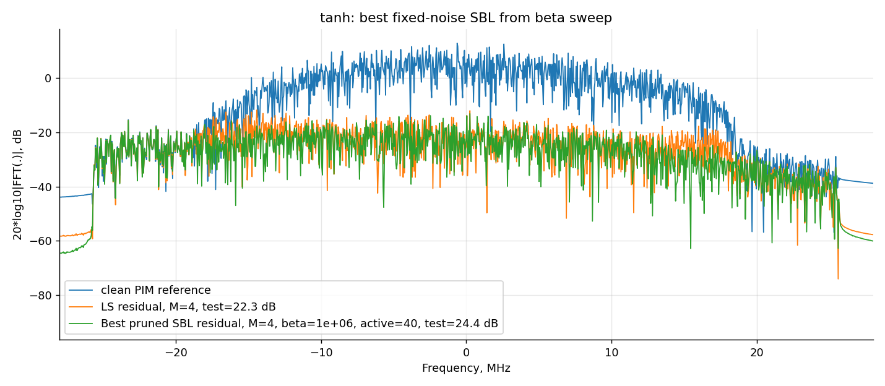
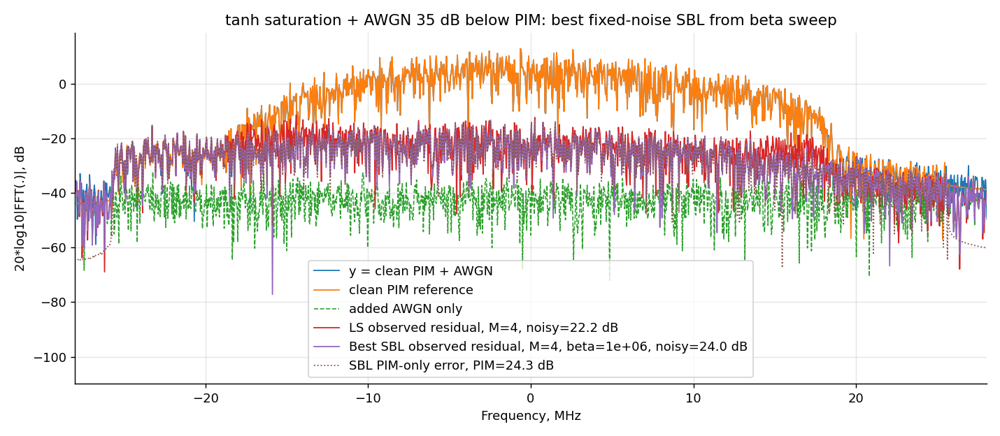
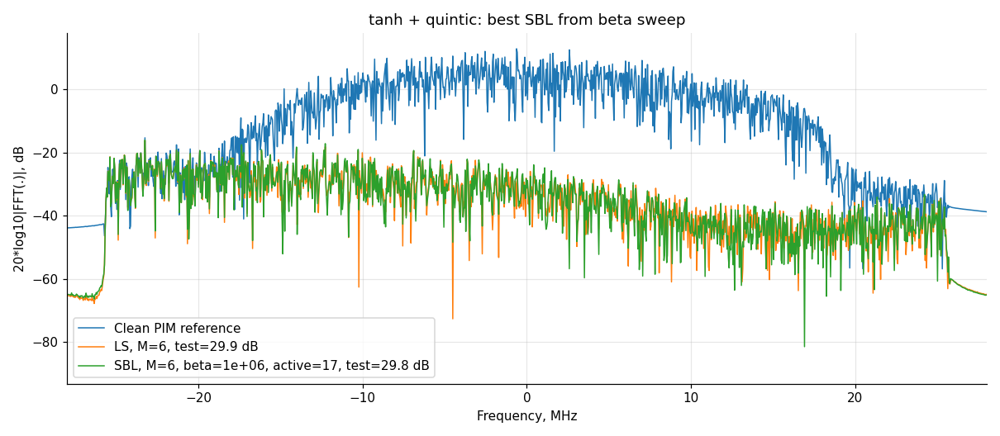

# Correlation-Pruned Fixed-Noise Sparse Bayesian Learning for Passive Intermodulation Cancellation

**Authors:** Oleg Kudryavtsev, Nikita Efimenko, and Anatoliy Efimov.

## Supplementary materials

This repository accompanies the paper and provides source code for reproducing the single-realization numerical examples, additional experimental figures, and Supplementary Table S1 with computational-resource measurements.

## Numerical examples

The examples compare dense ridge-regularized least squares (ridge-LS) with correlation-pruned fixed-noise sparse Bayesian learning (SBL) for passive intermodulation (PIM) cancellation.

| Example | PIM source | Cancellation dictionary | Observation | Code |
| --- | --- | --- | --- | --- |
| 1 | Cubic | Cubic | Clean | [Notebook 1](01_pim_cubic_source_cubic_dictionary_clean.ipynb) |
| 2 | Tanh | Cubic | Clean | [Notebook 2](02_pim_tanh_source_cubic_dictionary_clean.ipynb) |
| 3 | Tanh | Cubic | AWGN 35 dB below PIM | [Notebook 3](03_pim_tanh_source_cubic_dictionary_awgn_35db_below_pim.ipynb) |
| 4 | Tanh | Cubic-quintic | Clean | [Notebook 4](04_pim_tanh_source_cubic_quintic_dictionary_clean.ipynb) |
| 5 | Tanh | Cubic-quintic | AWGN 35 dB below PIM | [Notebook 5](05_pim_tanh_source_cubic_quintic_dictionary_awgn_35db_below_pim.ipynb) |

Each example contains its own signal generation, dictionary construction, estimation, evaluation, and plotting code. These notebooks reproduce the single-realization examples; they do not implement the full repeated benchmark or the resource-profiling workflow.

### Running the examples

Open an individual `.ipynb` file in Jupyter and execute its cells from top to bottom in a Python 3 environment with NumPy, SciPy, and Matplotlib. The signal parameters, random seeds, memory depths, and inference settings are defined in the code. Generated CSV files and plots are saved in experiment-specific subdirectories of `out/`.

The combined cubic-quintic experiment at `M = 8` contains 18,336 candidate columns and requires substantial memory. Retain the configured parameters when reproducing the reported examples.

## Supplementary figures

The following figures complement the spectral illustrations in the paper. Each figure corresponds to a single-realization numerical example.

### Figure S1. Clean tanh source with a cubic dictionary

Numerical example 2: `M = 4` and `beta = 10^6`. The spectrum compares the clean PIM reference with the ridge-LS and SBL residuals.

### Figure S2. Tanh source with a cubic dictionary and AWGN

Numerical example 3: AWGN 35 dB below PIM, `M = 4`, and `beta = 10^6`. The spectrum distinguishes the noisy observation, clean PIM, added noise, observed residuals, and SBL PIM-only error.

### Figure S3. Clean tanh source with a cubic-quintic dictionary

Numerical example 4: `M = 6` and `beta = 10^6`. The spectrum compares the clean PIM reference with the dense ridge-LS and sparse SBL residuals.

[**Supplementary Table S1 — Computational resource measurements**](resource_results.md)
reports computational resource measurements for the evaluated methods,
including dictionary construction time, fitting time, peak process memory,
and inference time. The table is provided in Markdown format.

## Experimental context

Refer to the paper for the mathematical model, parameter definitions, evaluation protocols, and interpretation of the results. The single-realization examples, repeated benchmark, and computational-resource measurements are distinct parts of the experimental analysis.
